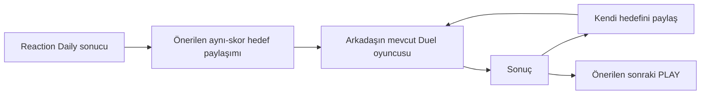

# KATOVIA 2.0 — PRODUCT AUDIT

**Tarih:** 6 Ekim 2026, Europe/Istanbul. **Kapsam:** audit + ürün stratejisi. Uygulama kodu, dependency, build çıktısı ve production değiştirilmedi; deploy yapılmadı, dosya silinmedi. Bu rapor ve yerel denetim kanıtları oluşturuldu.

**Kanıt ayrımı:** “Gözlem” canlı HTTP/tarayıcı veya repository bulgusudur. “Öneri/potansiyel” ürün değerlendirmesidir; gerçekleşmiş trafik, retention, dönüşüm veya arama hacmi değildir. Search Console’un çalıştığını kullanıcı bildirdi. Hesaba/verilerine erişilmedi; mevcut clicks, CTR, sıralama, DAU/D7 veya paylaşım dönüşümü bilinmiyor. Önceki test raporu yeni denetim yerine kullanılmadı.

## Current Product Health

**İşlevsel sağlık iyi; dağıtım ve devam akışı geliştirmeye açık.** Canlıda 15 genel V2 sayfa, iki kişisel oyuncu rotası ve iki legacy araç tarayıcıyla incelendi; 18 legacy HTML yolunun tamamı ayrıca HTTP 200 verdi. Üç Daily, beş tool, quiz oluşturma/arkadaş sonucu ve Reaction Duel/rövanş akışları çalıştı. Denetlenen tarayıcı oturumlarında yakalanan JavaScript pageerror yoktu.

En büyük fırsat, çalışan deneyimlerin sonuçlarını bir sonraki oynama veya paylaşma kararına bağlamak. TODAY sonucunda içerik içi devam bağlantısı yok; üst menü/altbilgi mevcut. PLAY paylaşımı rehber ve diğer deneyim kartlarından sonra geliyor. CREATE formu kısa quiz için bile uzun. Bunlar teknik arızadan çok ürün akışı sorunları. Ayrıca home’un ilk ekran START başarısı 844 px test yüksekliğine bağlı: daha kısa görünümde CTA kısmen veya tamamen aşağıda kalıyor.

## Strongest Area

**TODAY’nin hızlı, anlaşılır oyun çekirdeği ve genel teknik hafiflik.** STOP AT 5.00, denetlenen 844 px yüksek mobil ilk ekranda doğrudan oynanıyor; kısa ekran kapsamı aşağıda ayrıldı. Memory’nin günlük seed/difficulty değişimi ritüel için daha güçlü içerik temeli. Reaction mevcut motorla casual challenge’a dönüşebiliyor. Sistem hesap, upload veya backend yazması gerektirmiyor.

## Weakest Area

**Sonuçtan sonraki devam akışı; en kırılgan oluşturma ekranı mobil CREATE.** 390×844 EN ekranda ilk soru yaklaşık y=1.022, paylaşım bağlantısı oluşturma y=1.807. Sekiz uzun ama alan limitlerine uygun soru doldurulduğunda link sınırı ancak son işlemde bildirildi. Kullanıcının emeğinin paylaşılabilir olup olmadığı geç anlaşılıyor.

## Best Growth Loop

**Yapısal aday: Creator → arkadaşın quiz oynaması → Create Your Own.** Kişisel içerik ve doğrudan kendi quizini oluşturma CTA’sı doğal bir kullanıcıdan kullanıcıya yol kuruyor; canlı link bağımsız oturumda çalıştı. Ancak gerçek yayılma oranı ölçülmüş değil. Sonuç ekranında iki aynı CTA ve sonuç paylaşımının olmayışı bu döngüyü zayıflatıyor.

## Weakest Growth Loop

**PLAY → paylaşım.** Güçlü görsel malzeme var; mevcut paylaşım yalnız sayfa başlığı + canonical link. 390 px görünümde SHARE, Particle’da yaklaşık y=2.250, Piano’da y=2.225, Koi’de y=2.199. Görsel anı paylaşma isteği oluştuğu yerde paylaşım kontrolü bulunmuyor; seçilen mod veya görüntü karşıya taşınmıyor.

## SEO Health

**Temel sağlam, fırsat anlatımı eksik.** Genel 15 sayfada ayrı title/description, self canonical, bir H1 ve OG title/description/URL var. Üç PLAY sayfasında SoftwareApplication, beş tool’da WebApplication JSON-LD bulunuyor; sahte rating/review gözlenmedi. Sitemap yalnız bu 15 genel sayfayı içeriyor. `/p/` ve `/d/` noindex; rastgele yol ve `/d/does-not-exist/` gerçek 404.

Başlıca eksikler: TODAY açıklaması hâlâ tek oyun anlatıyor; hub title’ları arama niyetini az açıklıyor; incelenen hiçbir sayfada `og:image` yok; legacy sayfalarda canonical yok ve 10 legacy oyunda description yok. TR/EN UI var, fakat server HTML İngilizce ve ayrı dil URL/hreflang yapısı yok. Bunlar erişilebilirlik veya indeksleme arızası kanıtı değil; iyileştirme alanlarıdır.

## Viral Potential

**Mevcut en güçlü görsel vitrin adayı: Particle Universe.** Ses gerektirmeden hareket, üç mod ve burst ile kısa klibe uygun. Koi Pond daha sakin ve karakterli; Pixel Piano’nun avantajı ses/görüntü birlikteliği, fakat ilk boş/fazla karanlık görünümü daha zayıf. Bu sıralama görsel/işlevsel değerlendirme; paylaşım verisi değil.

## Retention Potential

Üç Daily, yerel streak ve ilk günlük sonuç altyapısı var. STOP sonucunda “yarın yeni deneme” ve 00:00 UTC bilgisi bulunuyor. Memory/Reaction’da benzer bir dönüş daveti daha zayıf. Canlı arayüzde personal best, hafta görünümü, countdown veya tomorrow teaser gözlenmedi. Önce bu küçük ritüel öğelerini ve sonuç sonrası devamı güçlendirmek değerli; D7 artışı henüz iddia edilemez.

## Cost Efficiency

**Zero-Bloat avantajı korunuyor.** Yeni genel sayfalarda soğuk tarayıcı oturumunun gözlenen sıkıştırılmış HTML+resource gövdeleri yaklaşık 30–34 KB. Ek bir runtime framework/Three.js yok; deneyim/tool/Creator/Duel runtime’ları ayrı yükleniyor. Bu laboratuvar gözlemi gerçek mobil CPU veya Core Web Vitals sertifikası değildir.

Öneri maliyetleri: **Z = ZERO-COST**, mevcut static/browser-side yapı, yeni ücretli servis yok. **N = NEAR-ZERO COST**, mevcut hostta ek küçük asset/transfer yükü. **F = FUTURE COST RISK**, backend/API/storage/edge veya ek operasyon gerekebilir. Z, mevcut domain/hosting koşullarının veya gelecekte sınırsız trafiğin bedelsiz olduğu anlamına gelmez.

## Top 10 Opportunities

Sıralama gözlenen sürtünme ve mevcut altyapıya göre yapılmıştır. Etki tahmini nitelikseldir; arama hacmi/dönüşüm ölçümü değildir. Paylaşım / SEO / retention sütunu sırasıyla olası etkiyi gösterir.

| # | Geliştirme | Neden / büyüme motoru | Maliyet | Karmaşıklık | Paylaşım / SEO / retention |
|---|---|---|---|---|---|
| 1 | Daily sonuç → mevcut Reaction Duel / sonraki oyun köprüsü | Sonucu yeni kullanıcıya veya ikinci deneyime bağlar; mevcut motor/link formatı hazır | Z | Düşük–orta | Yüksek / düşük / yüksek |
| 2 | PLAY paylaşım barı + browser-generated sonuç/görsel kartı | Anı paylaşmayı görünür ve görsel hale getirir | Z; statik OG için N | Orta | Yüksek / orta / orta |
| 3 | Creator quick-start + erken link bütçesi göstergesi | İlk soruyu erkene alır; son aşamadaki link başarısızlığını azaltmayı hedefler | Z | Düşük–orta | Yüksek / düşük / orta |
| 4 | Particle Immersive Mode + reset | Vitrini telefon ekranına ve kayda uygun hale getirir | Z | Orta | Yüksek / düşük / orta |
| 5 | Personal best + hafta görünümü + yerel reset saati | Tek günlük skorun kişisel gelişim anlamını artırır | Z | Orta | Orta / düşük / yüksek |
| 6 | QR/kartvizit için TOOLS keşfi ve modern ürün sunumu | Zaten çalışan değerli işlevleri görünür yapar; gerçek arama niyeti | Z; görseller N | Orta | Orta / yüksek / orta |
| 7 | Would You Rather Creator | Doğru cevap gerektirmeyen sosyal seçim; mevcut editor/player temelini kullanır | Z | Orta | Yüksek / orta / orta |
| 8 | Pixel Art Grid | TOOLS ile yaratıcı PLAY kimliği arasında köprü; özgün çıktı üretir | Z | Orta | Yüksek / orta / orta |
| 9 | Browser-side Image Kit | Compress/WebP/PNG işlevleriyle somut kullanım ve privacy avantajı | Z | Orta–yüksek | Düşük / yüksek / orta |
| 10 | Angle Hunt Daily | Mevcut üç oyundan farklı kısa precision mekaniği | Z | Orta | Orta / orta / yüksek |

## Do Now

- Home START’ını kısa viewport yüksekliğine de uyarlama; TODAY’nin üç oyunlu başlık/açıklamasını düzeltme; legacy geri dönüş anchor uyumluluğunu planlama; duplicate Creator CTA ve “1 DAYS” gibi küçük tutarsızlıkları giderme.
- PLAY SHARE’ı Canvas kontrol alanına alma; aynı anda az sayıda net kontrol tutma.
- Daily sonuçta bir “devam” seçeneği; Reaction sonucundan aynı skorla mevcut casual duel linki üretme.
- Creator’da ilk soru/örnek içerik ve link sınırını erkenden gösterme.
- GSC mevcut veri için küçük haftalık inceleme; doğrulanmış iletişim adresi varsa sade Idea/Bug bağlantısı.

Hepsi yeni servis gerektirmeyen adaylar. Bu audit sırasında uygulanmadı.

## Do Next

Özgün image/story card ve statik OG görselleri; Particle için immersive/reset pilotu; difficulty/version’a göre yerel personal best; QR/kartvizit TOOLS entegrasyonu; küçük bir Would You Rather veya Angle Hunt pilotu. Önce mevcut akışların kullanıcının elinde anlaşılır olduğunu doğrulamak gerekir.

## Experiments

Tek bir yeni PLAY: Fluid Ink veya Sand Sculpt; ikinci aşamada Soft Blob. Pixel Piano’da daha belirgin ilk dokunuş/tuş geri bildirimi. Rank These/Memory Challenge Creator. Kısa örnek sahneye dayalı organik tanıtım. Başarıyı vaat etmek yerine gönüllü kullanıcıların tekrar oynama ve arkadaş linkini tamamlama davranışıyla değerlendirme.

## Later

Server-persisted/private quiz, account/sync, global leaderboard/anti-cheat, kısa opaque link, kullanıcıya özel server OG, public UGC keşfi/moderasyonu, büyük medya kütüphanesi: **F**. Tam offline PWA: ek servis gerektirmese de lifecycle/versiyon karmaşıklığı nedeniyle daha sonra. SVG Optimizer gibi güvenli parser/bağımlılık incelemesi isteyen araçlar da erken backlog’un önünde değil.

## Avoid

1. Mevcut akışları bağlamadan çok sayıda yeni oyun üretmek.
2. Tek işlevin renk/mod varyasyonlarını ayrı SEO sayfalarına bölmek.
3. Gerçek işlevi olmayan “format × kullanım” pSEO kombinasyonları.
4. Küçük Canvas oyuncakları için global Three.js/framework eklemek.
5. Lisansı doğrulanmamış görsel, müzik, font veya kopyalanmış kod kullanmak.
6. “%100 private”, “zero network” veya “verified scores” gibi mevcut mimarinin desteklemediği iddialar.
7. Casual hedefleri gerçek rekabet/leaderboard gibi sunmak.
8. Oynamadan önce hesap, install, notification veya paylaşım zorunluluğu koymak.
9. Backend gereksinimini belirsiz ücretsiz kota/servis varsayımıyla çözmek; billing açmak.
10. Ana sayfayı proje vitrini veya onlarca generic tool kataloğuna dönüştürmek.

## Recommended 30-Day Roadmap

**6 Ekim–4 Kasım 2026. En fazla 10 iş.** Efor mevcut kodun yeniden kullanımına dayalı niteliksel tahmindir; süre/ROI garantisi değildir. Her yayın ayrı yetkilendirilmiş implementation işinde build/QA/rollback korumasıyla yapılmalıdır.

| # / dönem | İş | Etki / efor / maliyet | Bağımlılık | Neden ve kabul ölçütü |
|---|---|---|---|---|
| 1 / ilk hafta | Kısa ekranda START, TODAY copy/metadata, legacy anchor ve CTA tutarlılığı | Yüksek / düşük–orta / Z | Mevcut route/legacy koruma kuralları | 640/740/844 yükseklerde ilk eylem erişilir; üç oyun doğru anlatılır; eski anchor ve tek Creator CTA |
| 2 / ilk hafta | PLAY paylaşım kontrolünü Canvas yanına taşı | Yüksek / düşük / Z | Mevcut share adapter | 360/390/430’da anı yaşarken paylaşım bulunur; iptal/fallback doğru |
| 3 / ilk–ikinci hafta | Daily result → Reaction Duel / sonraki PLAY | Yüksek / düşük–orta / Z | Sonuç ve mevcut duel tokenı | Reaction skoru tekrar oynanmadan hedef linkine dönüşür; diğer Daily’lerde uygun tek devam CTA’sı |
| 4 / ikinci hafta | Creator quick-start ve erken payload bütçesi | Yüksek / orta / Z | Mevcut model/limitler | İlk soru kolay erişilir; paylaşılmayacak uzunluk son işlemden önce anlaşılır |
| 5 / ikinci hafta | Client image card + public static OG | Yüksek / orta / Z+N | Share/export modeli; özgün kod görselleri | Native files destek kontrolü, PNG/download/text fallback; Memory spoiler içermez |
| 6 / üçüncü hafta | Particle immersive + reset pilotu | Yüksek / orta / Z | Resize/snapshot/reset sözleşmesi; cihaz QA | Güvenilir çıkış, focus, orientation, reduced motion; fullscreen reddinde CSS fallback |
| 7 / üçüncü hafta | Yerel PB, reset countdown, hafta görünümü | Yüksek / orta / Z | Mevcut ledger; version/difficulty ayrımı | UTC gün değişimi korunur; TR için 03:00 bilgisi; geçmiş yanlış karşılaştırılmaz |
| 8 / üçüncü–dördüncü hafta | QR/kartvizit TOOLS keşfi + SEO/privacy kapsamı | Orta–yüksek / orta / Z+N | Eski URL ve hash koruma planı | Araçlar bulunur; lokal üretim iddiası doğru; yeni/legacy canonical stratejisi tutarlı |
| 9 / tüm dönem | Sade feedback, gönüllü pilot ve haftalık GSC kararı | Yüksek öğrenme / düşük / Z | Doğrulanmış alıcı; owner’ın mevcut GSC verisi | Hassas payload aktarılmaz; hangi giriş/CTA anlaşılmadığı kaydedilir; özel veriye dayalı sahte metrik yok |
| 10 / son hafta, koşullu | Tek Angle Hunt Daily pilotu | Orta–yüksek / orta / Z | 3 ve 7; ana akışların pilotta anlaşılması | İlk 10 saniyede hareket; keyboard/touch; ayrı günlük sonuç; kullanıcı isteği yoksa ertelenir |

Would You Rather, yeni PLAY ve Image Kit aynı ayda topluca yapılmamalı. Kullanıcı geri bildirimi/arama niyeti hangisini destekliyorsa sonraki paket ona ayrılmalı.

## Single Most Important Next Move

**Daily sonucunu bir sonraki kişiye veya deneyime bağla.** İlk somut pilot: Reaction Daily sonucunda “Bu skoru geçebilir misin?” ile mevcut `/d/?id=...` hedef linkini paylaşabilmek. STOP/Memory için çalışan sonraki Daily veya tek bir PLAY önerisi. Bütün sonuçlara aynı duel mekaniğini zorla uygulama.

Bu hamle mevcut motoru kullanır, backend gerektirmez ve bugünkü boşluğu kapatır: sonuç → paylaşım → arkadaş oynar → kendi hedefini paylaşır. Başarısı ölçülmüş değildir; bağımsız arkadaş oturumlarında görev tamamlama ve gönüllü geri bildirimle doğrulanmalıdır.

## A. Denetim kanıtı ve sınırları

Repository HEAD: `8094ad0ed2c202af3b976061e6faf95451e1c101`. Canlı cevaplar doğrudan HTTPS üzerinden kontrol edildi. Arama aracının root için verdiği eski stüdyo metni, güncel tarayıcı/HTTP cevabıyla uyuşmuyordu; canlı kararlar o cache’e dayanmadı. Bunun Google indeksinin bozuk olduğuna dair kanıt olduğu ileri sürülmüyor.

Gözlem ortamı: headless Chrome; 360/390/430×844 mobil viewport; home için ayrıca 390×740 ve 360×640; bazı Canvas denetimlerinde touch ve DPR 3; 844×390 landscape; hierarchy için 1440 px ek kontrol. Fiziksel iPhone/Android, Safari, ekran okuyucu, gerçek OS paylaşım menüsü ve gerçek ses dinleme testi yapılmadı. AudioContext’ın gesture sonrası `running` olması gözlendi; sesin estetik kalitesi fiziksel dinleme sonucu olarak sunulmuyor. Native iptal yolu browser stub’ıyla, clipboard çıktıları izole oturumda incelendi; dışarıya mesaj gönderilmedi.

19 ayrıntılı route gözleminde tüm cevaplar 200, overflow/pageerror yoktu. 18 legacy HTML ayrı HTTP incelemesinde 200. 37 kaynak fixture hash’i doğrulandı; CNAME/app-ads/data/vendor/assets korunuyor. Eski otomatik 39 Node/46 Chrome sonucu tarihsel implementation kanıtıdır; bu audit’te build veya aynı test paketi yeniden çalıştırılmadı.

Yerel kanıtlar: [route/metadata/ağ kayıtları](C:/katovia.com/.cache/product-audit-2026-10-06/routes.json), [gerçek akış/çıktı kayıtları](C:/katovia.com/.cache/product-audit-2026-10-06/flows.json), [mobil/PWA/fallback/keyboard](C:/katovia.com/.cache/product-audit-2026-10-06/extra.json), [home hiyerarşisi](C:/katovia.com/.cache/product-audit-2026-10-06/hierarchy.json), [legacy HTTP/SEO](C:/katovia.com/.cache/product-audit-2026-10-06/legacy.json). Bunlar audit kanıtıdır; production asset’i değildir.

## B. Route route canlı ürün ve ilk 10 saniye

Etkileşim süreleri gerçek kullanıcı medyanı değil, mekanik bekleme/işlem sayısıdır. Görsel kalite ve paylaşım potansiyeli editoryal değerlendirmedir.

| Sayfa | İlk izlenim / anlaşılabilirlik | İlk 3 sn → ilk 10 sn | Mobil / görsel | CTA | Tekrar ziyaret / paylaşım |
|---|---|---|---|---|---|
| [Home](https://katovia.com/) | Büyük hedef ve START ile oyun alanı belli; “creative technology” ifadesi hâlâ stüdyo çağrışımlı | Beş saniye hedefi → yaklaşık 5 sn’lik deneme | EN 360’ta START altı y=829, TR y=745; 844 yüksekliğe sığıyor | START çok net; diğer girişler aşağıda | Daily çekirdeği var; sonuç sonrası bağ zayıf |
| [TODAY](https://katovia.com/today/) | Üç oyuna rağmen giriş metni yalnız STOP anlatıyor | STOP talimatı → ilk oyun; diğerleri scroll ile | Temiz büyük kontrol; uzun dikey sıra | İlk oyuna net; oyun seçimi başta zayıf | Memory değişimi değerli; sonuçtan PLAY/duel linki yok |
| [PLAY](https://katovia.com/play/) | Üç görsel kart gerçek deneyim vaat ediyor | Bir deneyim seç → tek navigation sonrası etkileşim | Özgün CSS kart sanatı; mobil tek kolon | Kartlar anlaşılır | Keşif iyi; başlı başına günlük neden yok |
| [CHALLENGE](https://katovia.com/challenge/) | READY ile başlayabiliyor; açıklama/oluşturma CTA’sı tekrarlı | Sinyal bekle → 1,5–4 sn bekleme ardından sonuç/link | 180 px pad, y=523’te başlayarak ilk ekranda | READY net; “Create a challenge” aynı sayfaya da yöneliyor | Rövanş var; başkasına yollama daha açık anlatılabilir |
| [CREATE](https://katovia.com/create/) | Tek template adı var; seçim kataloğu yok | Başlık yaz → ilk soru için scroll; quiz tamamlanması yazma gerektirir | Okunur alanlar, çok fazla dikey boşluk | Preview/link oluşturma ilk ekranda değil | Kişisel paylaşım güçlü aday; authoring sınırı geç ortaya çıkıyor |
| [TOOLS](https://katovia.com/tools/) | Beş gerçek küçük browser aracı | Araç seç → veri gir | Temiz fakat diğer tool sitelerinden farkı metinle sınırlı | Kartlar net | Kullanım/SEO girişi; TODAY’ye bağlamlı yönlendirme yok |
| [LAB](https://katovia.com/lab/) | Eski projeler açıkça ayrı alanda | Bir projeyi aç | Tutarlı kartlar; legacy içeride farklı UI/dil | Eski araçlar kartlarda var | Düşük öncelikli keşif alanı doğru; tüm mevcut yollar temsil edilmiyor |
| [Particle](https://katovia.com/play/particle-universe/) | Hemen hareket ve modlar; dokununca burst | Akış görülür → drag/tap/mod seç | 360’ta Canvas y≈484; görsel sessiz videoya uygun | Önce PAUSE; SHARE y≈2.250 | En iyi mevcut görsel vitrin adayı; mod/scene linke taşınmıyor |
| [Piano](https://katovia.com/play/pixel-piano/) | Karanlık alan, soluk renk tuşları; dokunma vaadi | İlk nota/renk → birkaç dokunuş | İlk alanın çoğu boş; sesle birlikte anlamlı | MUTE/PAUSE görünür; SHARE y≈2.225 | Yaratıcı tekrar oynama adayı; sessiz klip etkisi düşük |
| [Koi](https://katovia.com/play/koi-pond/) | Balıklar ve gölet hemen anlaşılır | Suya dokun → yem/ripple/balık tepkisi | Sevimli düz/procedural çizim; premium derinlik sınırlı | PAUSE net; SHARE y≈2.199 | Sakin oturum için iyi aday; günlük geri dönüş sebebi yok |
| [JSON](https://katovia.com/tools/json-formatter/) | Net tek iş | Veri gir → formatla/kopyala | 390’ta RUN y≈648, output y≈880 | RUN anlaşılır; sonuç aşağıda | Faydalı, rekabetli intent; ilgili tool linkleri var |
| [Text Diff](https://katovia.com/tools/text-diff/) | Önce/sonra iki alan net | İki metni gir → karşılaştır | RUN y≈971; mobil sonuç y≈1.204 | Scroll gerekiyor | Satır bazlı gerçek fayda; limit/no-upload içerik doğru |
| [Regex](https://katovia.com/tools/regex-tester/) | Desen/bayrak/girdi, teknik kullanıcıya uygun | Desen/metin dene → JSON eşleşme | RUN y≈911, output y≈1.143 | Advanced form; örnekle daha hızlı olabilir | Worker limitli güvenli deney; beginner için sonuç sert |
| [Gradient](https://katovia.com/tools/css-gradient/) | İki renk + açı anlaşılır | Değiştir → RUN → CSS | Renklerin değişimi otomatik preview değil; RUN gerekiyor | RUN y≈769; output y≈1.002 | İşlev iyi; paylaşılacak yaratıcı çıktı yerine kod kopyası |
| [Palette](https://katovia.com/tools/color-palette/) | Tek renk → tonlar | Renk seç → HEX’leri al | RUN y≈535; beş tint çıktı | Basit ve en kısa tool formu | İsim geniş, işlev yalnız beyaza RGB tint; guide bunu açıklıyor |
| `/p/#payload` | Başlık/sorular doğrudan okunuyor | Seçeneklere bas → sonuç | Native button, tema; sonuçtan iki aynı CTA | Create Your Own güçlü ama tekrarlı | Arkadaş sonucu paylaşımı yok; doğrudan yaratma döngüsü var |
| `/d/?id=...` | Gelen hedef hemen yazıyor | READY → sinyal → WIN/LOSE/TIE | Büyük pad; görünür hedef | Rematch ve share var | Aynı hedefe retry; arkadaşına yeni hedef yollama ayrı adım |
| [QR legacy](https://katovia.com/laboratuvar/qr-kod-olusturucu.html) | Link/metin/Wi-Fi/WhatsApp seçenekleri gerçek değer | Girdi → Canvas QR ve aktif PNG düğmesi | Ayrı mavi UI, TR-only; mobil overflow yok | Oluştur/PNG net | TOOLS keşfinde eksik; geri bağlantı yanlış anchor |
| [Kartvizit legacy](https://katovia.com/laboratuvar/dijital-kartvizit-olusturucu.html) | Kart, QR ve vCard bir arada | İsim gir → üretim | Uzun ama gerçek preview/form; TR-only | Üç export kontrolü net | Somut fayda; modern SEO/TOOLS yüzeyi eksik |

Home “Katovia nedir?” sorusunu ilk oynama ile cevaplayabiliyor. Deneyim sayfaları hızla tepki veriyor. Creator’da 10 sn içinde bir alan düzenlenebilir; tamamlanmış paylaşımın 10 sn sürdüğü iddia edilemez. Tool’da hazırlanmış veriyle hızlı kullanım mümkündür; insanın veri hazırlama süresi ölçülmedi.

### Hiyerarşi ve Home için en fazla beş değişiklik

390 px EN home: TODAY y≈306; PLAY NOW y≈1.138; CREATE y≈2.445; CHALLENGE y≈2.698; TOOLS y≈2.925; LAB y≈4.403. TODAY güçlü. CREATE görünürlük açısından gizli. PLAY ilk ekranı kaçırıyor ama ikinci bölümdedir. TOOLS şu anda ana üründen fazla önde değil; LAB doğru biçimde arkada. Altı nav öğesi eşit ağırlıklı; mobilde menü açma adımı sonrası ayrım yapma yükü var. TR/EN geçişi gözlendi ve editor içeriğini korudu.

Kısa yükseklik kontrolü: 390×740 EN’de START y≈735–807, ilk ekranda yalnız yaklaşık 5 px’lik üst kenarı kalıyor. TR’de y≈673–745 ile çoğu görünse de tam sığmıyor. 360×640’ta EN y≈757–829, TR y≈673–745; düğme ilk ekranın tamamen dışında. Bu browser viewport bulgusu, belirli bir fiziksel telefonun sonucu diye sunulmuyor. “Mobile first fold başarılı” ifadesi yalnız 844 px denetimine genellenmemeli.

1. Hero’daki soyut ifadeyi kısa somut ürün cümlesiyle sadeleştir; START yalnız 844 px’de değil kısa viewport’larda da erişilebilir olmalı.
2. PLAY’in üç uzun mobil kartının yüksekliğini azalt; erişilebilir kompakt seçim/peek düzenini dene, otomatik kayan carousel yapma.
3. Creator girişini erken, kısa bir sosyal davet olarak görünür kıl; ilk ekrana altı CTA ekleme.
4. Daily tamamlandıktan sonra aynı alanda tek devam/hedef paylaşımı ve yarın reset bilgisini göster.
5. TOOLS/LAB’ın aşağıdaki ağırlığını koru; bütün backlog’u home’a ekleme.

## C. Daily audit ve 10 farklı aday

| Oyun | İyi taraf | Zayıf taraf | En değerli küçük iyileştirme |
|---|---|---|---|
| STOP AT 5.00 | Gizli timer, anlamlı mutlak fark, kısa gerilim; emoji/share zamanı isteğe bağlı | Her gün aynı mekanik; sonuçta aynı skor/fark farklı biçimlerde tekrarlanıyor | Tek ana skor + yerel PB/fark + sonraki deneyim |
| Memory Grid | Günlük seed ve 3×3/4×4 config gerçek içerik değişimi; hits/wrong/missed/accuracy | Sayısal sonuç kalabalık; difficulty/share bağlamı ve yarın daveti zayıf | Tek accuracy vurgusu, difficulty etiketi, yarın yapı/hafta ritüeli |
| Reaction | 1,5–4 sn random delay, early retry; mevcut duel motoruyla uyumlu | Her gün benzer mekanik; tek raw ms kişisel gelişim bağlamından yoksun | Aynı skorla casual hedef linki; aynı cihaz/difficulty’de yerel PB |

Canlı audit sonucu örnekleri: STOP `5.03`, `+0.03s`, beş emoji; Memory `3/3 · 100%`, konum taşımayan üç yeşil tile; Reaction `19 ms`. **19 ms browser otomasyonunun sonucudur, insan tepki benchmark’ı değildir.** Sonuç/streak reload’a dayanıklı yerel ledger’dır; doğrulanmış/global skor değildir. Memory ve Reaction’da `LOCAL STREAK / 1 DAYS`, STOP’ta `1 DAY` görüldü. Gün numarası STOP `#003`, diğerlerinde `#3`.

Yeni adaylar aşağıdaki sırada değerlendirilmeli; çoğu mevcut mekanikleri farklı girdi/kararla tamamlar. Hepsi özgün browser koduyla **Z**; seed, erişilebilirlik ve günlük sonuç kontrolü gerekir.

| # | Aday | Farklı mekanik / skor | Efor |
|---|---|---|---|
| 1 | Angle Hunt | Görülen hedef açıyı dial ile oluştur; mutlak derece hatası | Orta |
| 2 | Area Eye | Alanın doluluk yüzdesini tahmin et; yüzde-puan hatası | Düşük–orta |
| 3 | One Move Connect | Tek parçayı oynatarak bağlantıyı tamamla; çözüm/hamle | Orta |
| 4 | Color Match | Hedef tonu slider’larla oluştur; tanımlı renk farkı | Orta; renk erişilebilirliği gerekli |
| 5 | Pulse Count | Kısa browser-generated ses dizisinde vuruş sayısını bul | Orta; açık ses gesture’ı/alternatif kullanım |
| 6 | Trajectory Guess | Gösterilen hareketin iniş noktasını önceden işaretle | Orta |
| 7 | Rule Breaker | Görünür sembol kuralını bozan öğeyi seç; mantıksal çıkarım | Orta |
| 8 | Mirror Trace | Yolun simetriğini çiz; normalize edilmiş geometrik hata | Orta–yüksek |
| 9 | Balance Point | Ağırlıklara göre denge noktasını yerleştir; tork farkı | Orta |
| 10 | Tiny Packing | Az sayıda parçayı küçük alana sığdır; çözüm/boş alan | Orta–yüksek |

Rhythm/Memory/Grid’in sadece başka rengi veya başka hedef saniyesi yeni bir Daily diye sayılmamalı. PB Memory’de difficulty/version’a göre ayrılmalı; `3/3` ile `6/6` raw sayı üzerinden karşılaştırılmamalı.

## D. PLAY, 10 yeni fikir ve Immersive Mode

Particle en belirgin hareket/burst anını üretiyor; görsel kalite yeterli bir temel, premium “wow” için sahne/palette ve framing iyileştirilebilir. Piano’nun pentatonik tonu gesture sonrası AudioContext `running` durumuna geçti; tek dokunuştaki kare/ripple görseli sakin/boş. Koi’de yem ve ripple üretildi; balık çizimleri stil sahibi basit şekiller, uzun sakin oturum adayı. Üçünde de modüler küçük runtime, DPR cap ve reduced-motion pause var. `frameTarget=60` görüldü; gerçek cihaz FPS ölçümü değildir.

| # | Yeni PLAY | Ayırıcı etkileşim / kısa video fırsatı | Efor / maliyet |
|---|---|---|---|
| 1 | Fluid Ink | Parmağınla pigment akışı ve karışım | Yüksek / Z |
| 2 | Sand Sculpt | Granüler kumdan şekil yap, parmağınla aşındır | Orta–yüksek / Z |
| 3 | Destroy This Page | Deneyime ait bir sahneyi kır/parçala, resetle | Orta / Z |
| 4 | Grow a Tiny World | Çizgin boyunca bitki/dal/mini bahçe büyüt | Orta / Z |
| 5 | Soft Blob | Yay-kütle davranışlı jöleyi çek/bırak | Orta–yüksek / Z |
| 6 | Domino Run | Yerleştir, zinciri başlat; sonuç klibi | Orta–yüksek / Z |
| 7 | Newton’s Cradle | Ağırlığı çek, momentum aktarımını seyret | Orta / Z |
| 8 | Kaleido Press | Dokunuşları simetrik, renkli desenlere dönüştür | Orta / Z |
| 9 | Rain Room | Yağmur/ripple ve isteğe bağlı procedural ses; atmosferi değiştir | Orta / Z |
| 10 | Liquid Metal | Damlaları birleştir, ayır, şekillendir | Yüksek / Z; GPU bütçesi riski |

Neon Trails, magnetic particles ve basit gravity/orbit mevcut Particle’ın mod/palette geliştirmesi olarak ele alınmalı; ayrı deneyim sayısıyla büyüme yapılmamalı. Fluid akış alanı, Sand hücresel tanecik, Blob elastik yüzey, Metal birleşen damlacık olmalı; aynı parçacık animasyonunun dört adı olmamalı. Hiçbiri için harici medya veya Three.js zorunlu kabul edilmiyor.

**Immersive değer sırası:** Particle yüksek; Koi yüksek; Piano orta–yüksek, özellikle yaratıcı sesli oturumda. Fullscreen ve UI-hide ayrı özelliklerdir. Fullscreen kullanıcı gesture’ı gerektirir, promise reddedilebilir; mobilde zoom/permissions/browser desteği değişir. Feature detection + güvenilir CSS sahne modu fallback’i gerekir. [MDN requestFullscreen](https://developer.mozilla.org/en-US/docs/Web/API/Element/requestFullscreen), [MDN mobil kısıtlar](https://developer.mozilla.org/en-US/docs/Web/API/Fullscreen_API/Guide).

Bu birkaç satırlık tamamlanmış feature değildir: ortak runtime’da reset sözleşmesi yok; resize Particle’ı yeniden kuruyor, Koi’nin balık/yem/ripple durumunu sıfırlıyor. Fullscreen/orientation bu resize’ı tetikleyebilir. Sahne koordinatları, snapshot/reset, DPR bütçesi, pointer capture, focus restore, Esc/44px çıkış, safe area, hidden/BFcache disposal ve Piano audio state ele alınmalı. UI-hide çıkış/mute erişimini kaldırmamalı. Az Katovia branding’i kayda uygun olabilir; görüntüyü kaplayan watermark olmaz. iPhone/Safari desteği Chrome emülasyonundan çıkarılamaz.

## E. Share engine ve yaratıcı akışlar

**Daily:** marka, gün, direkt root link ve spoiler taşımayan emoji var. STOP share yaklaşık birkaç kısa satır; Memory aggregate tile hücre konumunu açıklamıyor. Reaction yalnız ms + tarih + link; ilk mesajın “Bunu geç” çağrısı zayıf. Raw süre tercihi STOP’ta var. Image card’da Memory cevap gridini çizme.

**Creator:** audit’te tek sorulu link 231 karakterdi ve bağımsız player çalıştı. Clipboard metni quiz başlığı + link; marka daha çok domain’de. `#payload` cevapları içeriyor, encryption değil. 1.800 karakter encoded payload cap’i nedeniyle sekiz uzun soru publish aşamasında reddedildi. Uzunluk göstergesi/uyarı önce gelmeli; “8 soru desteklenir” ile “her 8 soru linke sığar” birbirine karıştırılmamalı.

**Duel:** audit paylaşımı `Target: 19 ms` + kısa `/d/?id=v1.19` linkiydi. Marka/call-to-action metinde güçlendirilebilir. WIN/LOSE/TIE var; sayısal sonuç düz. Rematch aynı hedefi yeniden deniyor; arkadaşına kendi hedefini göndermek ayrı SHARE LINK işlemi. “Arkadaşına yeni hedef gönder” ve “Aynı hedefi tekrar dene” ayrımı anlaşılır olmalı.

**PLAY:** yalnız sayfa başlığı + canonical URL; seçilen mod/durum kayboluyor. Native unsupported → clipboard/manual yolu mevcut; audit manual alanı açıldı ve native AbortError sonrası manuel kopya zorlanmadı. Gerçek OS handoff/delivery denenmedi. Native resolve, mesajın gerçekten gönderildiği anlamına gelmez. [MDN Web Share](https://developer.mozilla.org/en-US/docs/Web/API/Navigator/share).

| Öneri | Değer | Maliyet / karmaşıklık |
|---|---|---|
| Score image card | Tek görselde skor/marka/CTA, native files veya download | Z / orta; spoiler ve font/layout QA |
| Dikey story card | Oyun/sahne anı ve küçük branding | Z / orta; kırpma/ölçek/device QA |
| Copy challenge | Kısa davet + mevcut token linki | Z / düşük |
| Quiz sonuç paylaşımı | Oyuncu puanını yazara/arkadaşa yollama; mevcut quiz linkini koru | Z / düşük–orta |
| Immersive screenshot | Mevcut deneyimin yerel görüntüsü | Z / orta; reset/resize sözleşmesine bağlı |
| Genel static OG image | Scraper’ın okuyacağı özgün PNG | N / düşük–orta |
| Kişiye özel server OG/short link | Link preview’da kişisel skor/başlık | F / yüksek; ilk ay gerekmez |

Client card, scraper’a özel server OG ile aynı şey değildir. Quiz fragment’ı HTTP isteğine gitmediğinden static hosting quiz başlığını server OG’ye dönüştüremez. Mevcut share adapter’ın yanına küçük snapshot/media adapter yeterli; büyük export framework gereksiz.

### CREATE template önceliği

Mevcut tek template doğrudan editora açılıyor; “şablon seçimi” kataloğu yok. Bir soru için title + soru + iki seçenek + doğru seçenek gerekiyor; içerik dili/tema ilk sorudan önce yer kaplıyor. İçerik çevirilmiyor, safe textContent kullanılıyor. Sonuçta iki CREATE YOUR OWN gözlendi; oyuncunun sonucunu paylaşma kontrolü yok.

| Sıra | Template | Viral hipotez / fark | Efor / maliyet |
|---|---|---|---|
| 1 | Would You Rather | İki seçenekli sosyal tercih; doğru cevap zorunlu değil | Orta / Z; toplam oy/poll sonucu backend olmadan iddia edilmez |
| 2 | Rank These | Bir sıralamayı arkadaşın sıralamasıyla karşılaştır | Orta / Z; keyboard reorder gerekir |
| 3 | Personality Test | Eğlencelik özgün profili paylaş; mevcut doğru/yanlış modelinden farklı | Orta / Z; teşhis/bilimsel profil iddiası yok |
| 4 | Memory Challenge | Kullanıcının küçük pattern’ını arkadaş hatırlasın | Orta / Z; mevcut memory engine ayrı mode |
| 5 | Visual Story | Metin + özgün kod şekilleriyle kısa hikâye/sonuç | Orta–yüksek / Z; URL bütçesi daha zor |
| — | Trivia | Mevcut doğru cevaplı modelin konu/preset çeşidi | Düşük–orta / Z; ayrı altyapı şart değil |
| — | Guess Me | Mevcut “Beni ne kadar tanıyorsun?” ile büyük ölçüde aynı | Düşük / Z; yeni template yerine preset |

En hızlı kazanım yeni template’den önce editor quick-start’tır. Uzun/private/revocable server yayın ayrı ürün ve F sınıfıdır; link tabanlı V1 buna eşit sunulmamalı.

### Duel adayları

Memory Duel: seed+version+difficulty+aggregate hedef, Z/orta. Pattern Duel: görünür kural/çözüm challenge’ı, Z/orta. Speed Duel: sınırlı tapping/seçme görevi, Z/orta; device/input farkı açık kalmalı. Stop at 5 Duel, Z/düşük–orta ve mevcut timing motorundan türetilebilir. Precision Duel hedef süre varyasyonuysa aynı ailede tutulmalı; ayrı oyun diye sayılmamalı. Hepsi casual/client-editable hedeflerle çalışabilir. Private answer, anti-cheat/global ranking veya güvenilir iki taraflı kayıt istendiğinde F/ayrı güvenlik mimarisi gerekir.

## F. Tools, QR/kartvizit ve privacy

JSON sonucu doğru formatlandı; hata UI’sı generic ve syntax highlighting yok. Text Diff gerçek satır LCS çıktısı verdi; 200 satır limiti büyük dosya kullanımını kısıtlıyor. Regex JSON match/index/groups üretti; 750 ms isolated worker guard kaynakta var, tarihsel QA’de timeout testli; bu audit’te kaynak ve normal akış incelendi. Gradient kullanılabilir CSS, Palette beş HEX tint üretti. Tüm tool guide’ları limit/yerel işlemeyi anlatıyor; örnek veri/tek tık deneme az. Sonuçlar mobilde çoğunlukla fold altında, kullanıcı RUN sonrası başarıyı hemen göremeyebilir.

Tool sayfaları dört diğer tool’a kart veriyor; JSON→Gradient gibi bağlar otomatik kategori ilişkisi, gerçek görev ilişkisi değil. İki alakalı tool + işlemden sonra isteğe bağlı tek kısa TODAY/PLAY daveti daha iyi hedeflenebilir.

**Sonraki tool sıralaması — talep hacmi doğrulanmış değildir:**

| # | Aday / intent | Efor | Olası değer / sınıf |
|---|---|---|---|
| 1 | Image Compressor — dosyayı küçült | Orta–yüksek | Somut çıktı, rekabetli SEO / Z |
| 2 | WebP → PNG — uyumlu/lossless çıktı | Orta | Açık görev; büyük pixel sınırı gerekir / Z |
| 3 | PNG → WebP — format/kalite seçimi | Orta | Aynı image engine’i yeniden kullanır / Z |
| 4 | Pixel Art Grid — küçük görsel üret | Orta | Katovia kimliği + share + SEO / Z |
| 5 | Timestamp Converter — Unix/date/timezone | Düşük–orta | Küçük, net developer görevi / Z |
| 6 | UUID Generator — identifier üret | Düşük | Native crypto, küçük footprint / Z |
| 7 | Favicon Generator — küçük ikon çıktıları | Orta | Image/Pixel Art ile ilişkili / Z |
| 8 | Character Counter — karakter/kelime/byte | Düşük | Net metin görevi; güçlü rekabet / Z |
| 9 | Case Converter — metin biçimi | Düşük | Metin ailesiyle anlamlı link / Z |
| 10 | Stopwatch / Timer — süre ölç | Düşük–orta | Timing kimliğine uyum; background doğruluğu / Z |
| 11 | Base64 Encoder | Düşük | Fayda var; Unicode ayrımı gerekir, daha az farklılaşma / Z |
| 12 | Online Click Counter | Düşük | Basit, Speed toy’a yakın; ayrı SEO değerini test et / Z |
| 13 | Slug Generator | Düşük | Text utility preset’i; düşük farklılaşma / Z |
| 14 | SVG Optimizer | Yüksek | Parser/sanitization/bağımlılık ve security kapsamı daha ağır / Z veya seçilen çözüme göre F |

İlk üç ortak image engine paylaşabilir; her route gerçek farklı çıktı sunmalı. Image dosya/decoded pixel/memory limitleri şart. Her format kombinasyonu için işlevsiz yüzlerce sayfa üretme. Bütün 14 aday aynı ayın backlog’una alınmamalı.

QR, metin/link/Wi-Fi/WhatsApp → yerel Canvas üretimi yaptı; kartvizit isim → kart/QR/vCard kontrollerini etkinleştirdi. Denetimde yalnız GET HTML ve iki same-origin JS isteği görüldü, form girdisine bağlı POST/upload yoktu. JS kaynaklarında Canvas/toDataURL/Blob ve textContent kullanımı görülüyor; localStorage/form gönderimi bulunmadı. Dosyalar dışarıya gönderilmedi, fiziksel QR scan testi yapılmadı.

“Runs in your browser”, “No upload required for generation”, “Processed locally” bu iki araç ve beş yeni tool için kapsamı belirtilerek kullanılabilir. **“%100 private”/“zero-data everywhere” önerilmiyor:** hosting normal istek metadatasını görebilir; dil/streak/draft yerel saklanır; kullanıcı paylaşım/export dosyası veri içerir; Wi-Fi QR parola taşır; quiz linki cevapları içerir. Native paylaşım kullanıcının seçtiği uygulamaya veriyi aktarır.

QR/kartvizit zaten title/description taşıyor; canonical/OG/schema/sitemap ve TR/EN V2 UI eksik. Önce TOOLS’da var olan yolları görünür yap; gerekiyorsa sonra modern wrapper/migration. Eski yolları silme. Legacy hash korumasını metadata değişikliği için sessizce gevşetme; yeni görevde açık koruma/alias planı oluştur. Geri linkteki `../index.html#laboratuvar` için yeni root’ta alias anchor eklemek, eski dosyayı değiştirmeden uyumluluk sağlayabilecek adaydır.

## G. Production SEO, Search Console ve içerik fırsatları

| Öncelik | Gözlem | Aksiyon |
|---|---|---|
| P1 ürün/mesaj | TODAY H1 “One attempt. Five seconds.”, description yalnız STOP | Üç oyunu doğru anlat; sayfa üstünde kısa oyun seçimi |
| P1 dağıtım | Denetlenen 19 sayfada `og:image` yok | Özgün static PNG; kişisel server OG ile karıştırma |
| P2 arama niyeti | CREATE/CHALLENGE/PLAY/TOOLS hub title’ları yalnız alan + Katovia | İçeriği anlatan kısa özgün title; keyword stuffing yok |
| P2 legacy | 18 legacy canonical yok; 10 oyunda description yok; QR/kartvizit sitemap dışında | GSC performansına göre korumalı SEO planı; hepsini rastgele taşıma |
| P2 dil | SSR lang=en; hreflang/ayrı TR URL yok | TR query/country sinyali varsa gerçek dil sayfalarını planla; aynı URL’ye sahte alternatif verme |
| P2 migration | `/v2/` HTTP 200 meta/JS redirect; robots `/v2/` disallow | GSC’de eski index durumunu kontrol et; gerekiyorsa crawler’ın migration’ı okuyabilmesini planla |
| P3 keşif | `guzel-sozler.html` canlı ama V2 registry kartlarında yok; bazı eski adlar farklı | LAB kapsamını/gerçek oyun adını eşleştir; ör. Taş Yağmuru URL’sinin title’ı Dağ Tırmanma |
| P3 tutarlılık | 404 Türkçe; bazı sonuç sayıları/dil küçük tutarsız | Ürün polish; kritik SEO arızası gibi ele alma |

Canonical/OG/H1 ve 15 public title/description benzersizliği iyi. JSON-LD parse edildi; 8 doğru tür var. Google rich result veya indeksleme garantisi çıkarılmaz. Open Graph’ın temel alanlarından `og:image` eksikliği görsel dağıtım fırsatıdır. [Open Graph protokolü](https://ogp.me/).

Robots, kişisel `/p/` ve `/d/` noindex HTML’inin okunmasına izin veriyor; bu uygun ayrım. `/v2/` disallow/noindex birleşimi eski yolun önceden indeksli olduğu durumda inceleme gerektirir; **disallow deindex demek değildir**. Google seçtiği canonical ve indeks durumunu live HTTP cevabından kesin çıkaramazsın. [Google URL Inspection](https://support.google.com/webmasters/answer/9012289).

### Search Console: erken 30 gün karar kuralları

Kurulum engeli varsayılmadı. Repository’nin eski readiness dokümanındaki “USER ACTION REQUIRED” tarihsel; kullanıcının SC artık çalışıyor bilgisi güncel kabul edildi. HTML verification tag gözlenmemesi doğrulanmamış site demek değildir; DNS/başka yöntem olabilir. Şu an hesap verisi olmadan sıralama kaybı veya CTR problemi ilan edilemez.

Aşağıdakiler **önerilen operasyon eşikleri**, Google standardı veya mevcut veri değildir:

| Dönem / sinyal | Eşik veya ayrım | Aksiyon |
|---|---|---|
| İlk hafta: erişim/index | Public sayfada beklenmeyen noindex, robots block, 404 veya fetch failure | Bekleme yerine neden araştır; intentional `/p/`, `/d/`, `/v2/` ile karıştırma |
| 7–14 gün: index | Sitemap’teki gerçek sayfa hâlâ unknown/not indexed | URL Inspection sebebi, internal links, rendered içerik ve son crawl’ı incele; tekrar tekrar indexing isteme |
| Her hafta: impressions/query/page | Az veri; page-query-device-country kohortu <100 impression | CTA/title için istatistiksel hüküm verme; intent notu topla |
| 14–30 gün: CTR | Aynı kohortta ≥500 impression, pozisyon çoğunlukla 4–10 ve CTR <%1 | Snippet/intent uyumunu incelemeye aday; evrensel CTR hedefi değildir |
| 14–30 gün: opportunity | Pozisyon 11–30, tekrarlanan alakalı sorgular | Gerçek tool işlevi/guide/örnek ve iki alakalı internal linki güçlendir |
| Kıyas | Benzer kohortlarda en az 30 click ve karşılaştırılabilir dönem | Tek değişiklikle öncesi/sonrası incele; kesin nedensellik iddia etme |
| Brand / non-brand | Branded ve görev sorgularını ayır | Tool keşfi ile Katovia bilinirliğini aynı büyüme sayısına toplama |
| CWV alan verisi | Mobil/desktop p75: LCP ≤2,5 sn, INP ≤200 ms, CLS ≤0,1 | Veri varsa izle; düşük veri/CrUX yokluğunu “passed” sayma |

Clicks/impressions/CTR/average position; query/page/country/device filtreleri birlikte okunmalı. Ortalama pozisyon dalgalanması tek başına kalite hükmü değildir; sorgu tabloları anonymized query’leri eksik gösterebilir. SC, quiz→arkadaş veya D7 retention ölçümü değildir. [Google Performance report](https://support.google.com/webmasters/answer/7576553), [Google veri notları](https://support.google.com/webmasters/answer/10268906), [Web Vitals eşikleri](https://web.dev/articles/vitals).

### Gerçek işlevli SEO içerik fırsatları

| Alan / öneri | Search intent | Efor | Olası değer / maliyet |
|---|---|---|---|
| JSON’da geçerli/geçersiz örnek + anlamlı hata | Format/validate, trailing comma sorunu | Düşük | Görev tamamlama / Z |
| Text Diff’te satır işaretleri/limit örneği | İki metindeki değişikliği bul | Düşük | Mevcut intent’e daha iyi cevap / Z |
| Regex’te 3 özgün örnek/preset | JS match/groups/flags dene | Düşük–orta | Başlangıç bariyerini azaltma / Z |
| Gradient canlı örnek/palette ilişkisi | İki renkten CSS gradient | Düşük–orta | İşlev ve ilgili kullanım / Z |
| QR/Wi-Fi/vCard mevcut işlevini iyi anlat | QR PNG / Wi-Fi / vCard oluştur | Orta | Zaten gerçek ürün; arama değeri hipotezi / Z+N |
| Particle kısa how-to ve mode açıklaması | Interactive particle toy | Düşük | Niş keşif, hacim doğrulanmadı / Z |
| Piano keyboard/touch örneği | Pentatonic browser music toy | Düşük | Daha hızlı keşif / Z |
| TODAY üç oyun, UTC/yerel reset ve skor nasıl okunur | Daily mini games / reaction / memory | Düşük | Doğru ürün anlatımı / Z |

Rehberler işlevli sayfanın parçası olsun. Her keyword için kopya landing üretme. Önce SC’nin gördüğü gerçek sorguları kullan; on ayrı mekanik/difficulty URL’si açma.

## H. Internal linking ve retention

Önerilen link ağı kullanıcı görevinden sonra **en fazla bir veya iki** anlamlı seçenek göstermeli:

- Tool → aynı görevde iki ilgili tool: JSON→Diff/Regex, Gradient→Palette; ardından isteğe bağlı kısa TODAY molası.
- PLAY → iki başka PLAY zaten var; paylaşım onlardan önce erişilebilir olsun.
- Daily sonuç → sıradaki tamamlanmamış Daily; Reaction→aynı skor challenge; hepsi bittiğinde bir PLAY.
- Creator sonuç → tek Create Your Own + score share; isteğe bağlı tek PLAY, form tamamlanırken link bombardımanı yok.
- Duel sonuç → kendi hedefini arkadaşına yolla veya aynı hedefi retry; isteğe bağlı sonraki oyun.
- LAB → ilgili modern TOOLS; eski geri anchor’ın uyumluluğunu koru.

Retention adaylarının sırası: mevcut streak’i sonuçta daha görünür kıl; reset countdown/yerel saat; difficulty/version’a göre personal best; haftalık üç oyun işaretleri; spoiler taşımayan tomorrow teaser; sonra mevcut oyunlarla week challenge. Hepsi Z. Türkiye için 00:00 UTC = 03:00 yerel bilgisi gösterilebilir, global seed günü değiştirilmemeli. Notification baskısı, kayıp streak utandırması, zorunlu paylaşım veya yapay aciliyet kullanılmamalı.

Yerel kayıt cihaz değişiminde/silmede kaybolabilir; bunu cloud sync diye sunma. Mevcut validator gameVersion’a bağlı; future version değişiminde geçmiş/streak read-migration planı gerekir. Gerçek D1/D7 ve viral katsayı için veri yok; ilk öğrenme küçük gönüllü pilot ve açık feedback üzerinden yapılabilir.

## I. PWA, feedback, mobil ve performans

**PWA: bu ilk 30 günün önceliği değil.** Manifest linki/registration kodu gözlenmedi; yeni browser context’te SW registration/controller yoktu. Ana ekran kısayolu ile doğrulanmış offline PWA aynı şey değildir.

Artı: tekrar açma, seçilmiş oyuncakların offline kullanımı. Risk: stale HTML/chunk, yeni/eski gameVersion, UTC/day rollover, rollback’in önbellekteki istemcide gecikmesi, UGC fragment/quota ve ledger sürekliliği. SW update’in waiting/lifecycle ve cache yönetimi vardır; “bir dosya ekle offline olsun” değildir. [Service workers](https://web.dev/learn/pwa/service-workers), [Lifecycle](https://web.dev/articles/service-worker-lifecycle).

Trigger: pilotta düzenli geri gelme ve install/offline talebi oluşması; update/rollback ve storage sürüm testlerinin hazır olması. İlk kapsam seçilmiş PLAY + shell; official Daily’de offline tarihi/kuralları açık; third-party/kişisel query response’ları topluca cache’leme yok; kullanıcıyı oyun ortasında reload ettirme. Native manifest/orijinal ikonla başlanabilir; push/backend şart değil. Maliyet Z/N, mühendislik eforu orta–yüksek.

**Feedback:** doğrulanmış alıcı adresi varsa mailto ana düşük sürtünmeli seçenek; mail client yoksa kopyalanabilir adres/static yönerge. Teknik bug için doğrulanmış açık GitHub issue yolu ikinci seçenek; GitHub hesabı/public görünürlük gerekebilir. Form SaaS ilk seçim değil: veri alıcısı, saklama, spam, quota ve ücret koşulları ayrı değerlendirilmeli. Otomatik e-posta/issue oluşturulmadı. Route paylaşırken quiz fragment’ı, kişisel soru/cevap, Wi-Fi parola/vCard veya draft otomatik eklenmemeli; browser/version gibi kullanıcı inceleyebildiği sınırlı bilgiler yeterli.

**Mobil:** 360/390/430 incelendi, tested tool/PLAY rotalarında overflow yok. Kontroller büyük; form çıktıları ve Share için scroll yükü yüksek. 844×390 landscape Canvas yüksekliği 340 px: sayfa chrome/controls ile tam sahne değildir. Üç deneyim async media-change beklenince reduced-motion pause oldu. Piano ilk dokunuşta audio başlattı. Koi’de ArrowRight de yem veriyor, sonra Space ikinci yem veriyor; yardım “arrows focus, Space feed” dediği için keyboard semantiğiyle küçük uyumsuzluk var. Physical touch feel, Safari, browser toolbar/safe-area ve OS share testi yapılmadı.

**Gözlenen soğuk browser transferleri:** root 32.723 B; TODAY 30.895; PLAY hub 30.248; Particle 33.335; Piano 33.622; Koi 33.493; CREATE 33.129; CHALLENGE 31.885; beş tool 32.575–32.695; QR 22.425; kartvizit 23.025. HTML+resource **encoded body** toplamı, request/header dahil değil. Testte throttling yok, CDN önbelleği olabilir. Navigation loadEventEnd V2’de yaklaşık 256–564 ms; bu insan ilk eylem süresi, gerçek mobil LCP/INP veya sürekli FPS değildir.

Kaynakta yalnız Vite 8.3.2 ve Playwright 1.63.0 devDependencies; production ağır runtime library yok. Shared JS yaklaşık 24 KB gzip, CSS yaklaşık 4,2 KB gzip; deneyim düzeyinde ek küçük chunk’lar. Zero-Bloat korunuyor, henüz agresif bundle yeniden yazımı gerekmiyor.

En büyük beş future performance riski:

1. Scene/shader/Three.js’ı bütün sayfalara yüklemek.
2. Görsel/video/font ve kart export kütüphanelerini erken yüklemek.
3. Image decode, Sand/Fluid/Blob veya export pixel alanını sınırsız bırakmak.
4. Yeni dil/guide/game kodunu shared bundle’da kontrolsüz biriktirmek.
5. PWA cache, eski retained chunk ve ledger version politikalarını uyumsuz geliştirmek.

## J. Maliyet ve copyright/lisans kararı

Önerilerin default’u özgün native DOM/CSS/Canvas/Web Audio ve mevcut altyapıyı yeniden kullanmak. Yeni font/media/logo/ses paketi gerekmez. PNG/OG görselleri kodla üretilmiş sahne/kartlardan hazırlanabilir. Trivia/preset soruları, hikâye metinleri ve görsel karakterler özgün yazılmalı; popüler marka/oyun assetleri kopyalanmamalı.

Mevcut lockfile lisans metadata envanteri: MIT 25, Apache-2.0 4, MPL-2.0 12, ISC 1, BSD-3-Clause 1; 43 lisanslı entry. Optional platform paketleri sayıyı artırıyor. Mevcut kjua 0.10.0 vendor/notice korunuyor. Lisans koşullarına göre notice/source yükümlülükleri korunmalı; metadata sayımı eski bütün assetlerin telifinin yeniden temizlendiği anlamına gelmez. [MIT](https://opensource.org/license/mit), [Apache-2.0](https://www.apache.org/licenses/LICENSE-2.0), [Mozilla MPL FAQ](https://www.mozilla.org/en-US/MPL/2.0/FAQ/).

Bir future parser/library gerçekten gerekirse eklemeden önce adı, kesin versiyonu, lisansı, commercial-use/notice koşulları ve lazy bundle etkisi kaydedilmeli. Bu audit yeni paket/servis önermeyi zorunlu çözüm kabul etmedi, hiçbirini eklemedi. Statik kartın küçük hosting yükü N; server OG, persistent UGC/sync/global competition F. Ücretli veya billing gerektiren çözüm yalnız ayrı öneri olabilir; burada kaynak, ödeme hesabı, Blaze, hosting değişimi veya servis kurulumu yapılmadı.

**Karar:** Önce çalışan sonuçları paylaşılabilir/devam edilebilir hale getir; Creator’ın ilk paylaşımına ulaşma maliyetini azalt; Particle’ın ekranı ve paylaşım anını güçlendir. Yeni Daily/PLAY/TOOLS adaylarını bundan sonra, kullanıcı veya SC sinyalinin desteklediği tek bir pilot olarak seç.
